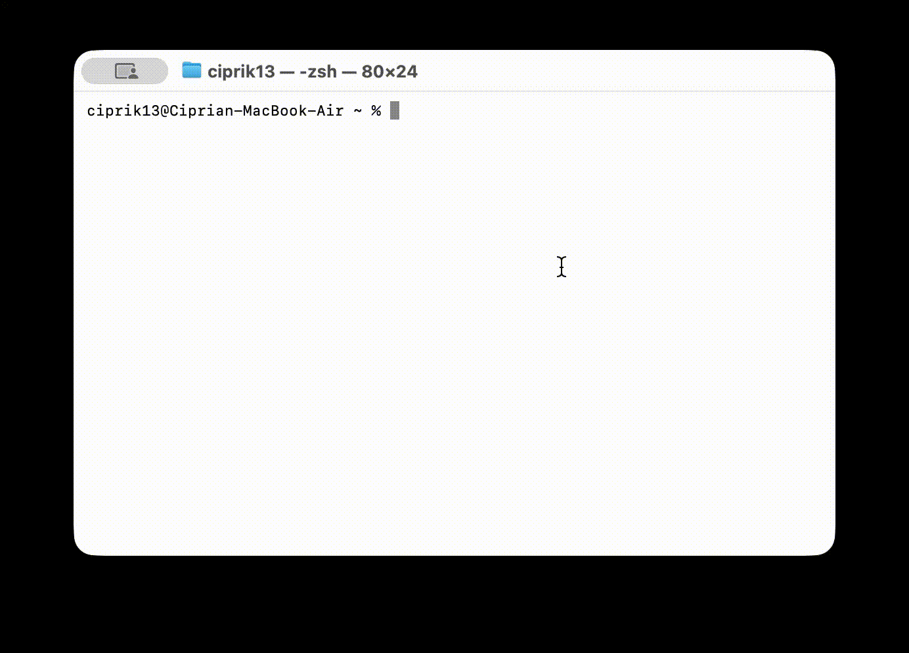

# go2web

A CLI tool that makes raw HTTP/HTTPS requests over TCP sockets — no HTTP libraries used.

Built with Node.js (`net` and `tls` modules only).

## Demo

### Help (`-h`)


### Fetch URL (`-u`)


### Search (`-s`)


### Cache demo (`--cache-demo`)



## Usage

```bash
go2web -h                        # show help
go2web -u <URL>                  # fetch a URL and print human-readable response
go2web -s <search-term>          # search and print top 10 results
go2web -s <search-term> <no>     # fetch the Nth search result
go2web --cache-demo <URL>        # demonstrate memory + disk cache
```

## Examples

```bash
# Fetch a real website
go2web -u https://www.w3schools.com/js/js_intro.asp

# Fetch a public JSON API — random cat fact
go2web -u https://catfact.ninja/fact

# Fetch a Chuck Norris joke
go2web -u https://api.chucknorris.io/jokes/random

# Follow redirects automatically
go2web -u http://httpbin.org/redirect/3

# Search something relevant to the lab
go2web -s "HTTP over TCP sockets"

# Open the 2nd search result directly
go2web -s "HTTP over TCP sockets" 2

# Demonstrate memory + disk cache
go2web --cache-demo https://catfact.ninja/fact

# Clear disk cache
rm -f ~/.go2web/cache.json
```

## Features

| Feature             | Details                                                                    |
| ------------------- | -------------------------------------------------------------------------- |
| Raw TCP sockets     | HTTP via `net`, HTTPS via `tls`                                            |
| HTML stripping      | Human-readable output, no tags                                             |
| HTTP redirects      | Follows 3xx automatically (up to 5 hops)                                   |
| Memory + disk cache | Repeated requests served from memory or from ~/.go2web/cache.json          |
| Content negotiation | `Accept: application/json, text/html` — JSON pretty-printed, HTML stripped |
| Search              | Yahoo (primary) + DuckDuckGo (fallback)                                    |
| Clickable results   | `-s <term> <N>` fetches the Nth result                                     |

## Requirements

- Node.js (no npm install needed — zero dependencies)

## Clear Cache

```bash
rm -f ~/.go2web/cache.json
```

## Run without `node` prefix

```bash
chmod +x go2web.js
./go2web.js -u https://example.com
```
